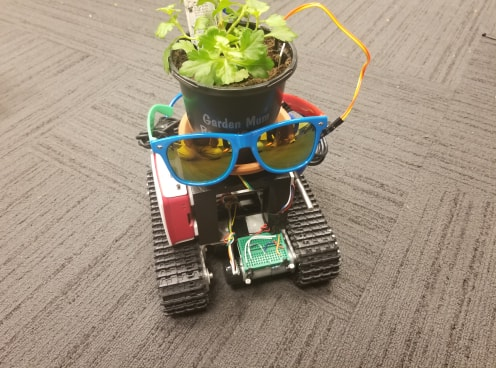

# Pot Buddy


## Here lie the blueprints of your own robotic body for your plant buddies.

Pic:




## Getting Started

Clone or download the repo recursively and follow carefully.

## Parts

In order to build this plant body, you will need to gather the following items:

Photocell - https://www.amazon.com/dp/B01N7V536K/ref=sxts_kp_bs_tr_lp_1?pf_rd_m=ATVPDKIKX0DER&pf_rd_p=8778bc68-27e7-403f-8460-de48b6e788fb&pd_rd_wg=2kx2P&pf_rd_r=W7WRPPWA72XV2BSXW33X&pf_rd_s=desktop-sx-top-slot&pf_rd_t=301&pd_rd_i=B01N7V536K&pd_rd_w=h8QC9&pf_rd_i=photoresistor&pd_rd_r=6d87e83e-b664-420d-9448-ff4e6a7c84a1&ie=UTF8&qid=1536471196&sr=1

Moisture Sensor - https://www.amazon.com/WINGONEER-Hygrometer-Humidity-Detection-Arduino/dp/B01H6WK51I/ref=sr_1_2?s=electronics&ie=UTF8&qid=1536471213&sr=1-2&keywords=moisture+sensor

Temperature Sensor - https://www.amazon.com/Gikfun-DS18B20-Temperature-Waterproof-EK1083x3/dp/B00Q9YBIJI/ref=sr_1_3?s=electronics&ie=UTF8&qid=1536471286&sr=1-3&keywords=temperature+sensor)

Raspberry Pi 3 - https://www.amazon.com/Raspberry-Pi-RASPBERRYPI3-MODB-1GB-Model-Motherboard/dp/B01CD5VC92

Arduino - https://www.amazon.com/RoboGets-Compatible-ATmega328P-Microcontroller-Electronics/dp/B01N4LP86I/ref=sr_1_2_sspa?s=electronics&ie=UTF8&qid=1536470717&sr=1-2-spons&keywords=arduino+uno&psc=1)

Aux Cord Speaker - https://www.walmart.com/ip/Onn-Mini-Bluetooth-Speaker-Cobalt-Blue/449819477

Battery Pack - https://www.amazon.com/Vanki-Battery-Holder-Case-Leads/dp/B073XC52BG/ref=sr_1_3?ie=UTF8&qid=1536470986&sr=8-3&keywords=5+AA+battery+pack

6 Volt DC Motor Tank Base (You can use any, nothing fancy mine was like $50) - Couldn't find the link to the one I used, Sorry :(

L293D DC Motor Driver - https://www.amazon.com/Controller-H-Bridge-Stepper-Mega2560-Duemilanove/dp/B01BWLICV4/ref=sr_1_16_sspa?s=electronics&ie=UTF8&qid=1536471038&sr=1-16-spons&keywords=l293d+motor+driver&psc=1

### Prerequisites/Installation

You will need the following python libraries (I recommend Python 3) on your Raspberry Pi 3: pyserial, pyrebase, and gtts. Which can all be downloaded through pip installation. 

For example:

```
sudo pip install <missing pyhton library>
```

## Setup

First I connected the Photocells (See this if needed: https://learn.adafruit.com/photocells/using-a-photocell) to the arduino and checked if each was working. (I used analog pins A0, A1, A2, A3 on the Arduino Uno)


Next I did the same with the Moisture Sensor (See this: https://www.instructables.com/id/Arduino-Soil-Moisture-Sensor/) and the Temperature Sensor (See this: https://create.arduino.cc/projecthub/TheGadgetBoy/ds18b20-digital-temperature-sensor-and-arduino-9cc806) (Theses two sensors used pins , respectively A4 and 2)

*IMPORTANT* Then I connected the Raspberry Pi 3 to the Arduino using the Serial Cable and made sure the connection worked correctly, as seen here: https://www.instructables.com/id/Raspberry-Pi-Arduino-Serial-Communication/. Then after I connected the 6 Volt DC Motor Tank Base with the Battery Pack, and the L293D DC Motor Driver (See this: https://howtomechatronics.com/tutorials/arduino/arduino-dc-motor-control-tutorial-l298n-pwm-h-bridge/)(The pins I used for the motor driver were ENA: 5, IN1: 6, IN2: 7, IN3: 8, IN4: 9, ENB: 10)

Lastly, I used various sized double-sided sticky foam tape to stick all the parts together.

## Run

When your ready run upload the pi_slave.ino code to the Arduino Uno, move the stuff in the pi folder to the Desktop on the Raspberry Pi 3, and run rpi_potbuddy.py to watch the magic.

## Authors

* [Anoop Babu](https://github.com/anoopbabu29)
* [Jamshidbek Mirzakhalov](https://github.com/mirzakhalov)
* [Teresa Flaitz](https://github.com/teresaflaitz)
* [Willie McClinton](https://github.com/wmcclinton)

## Acknowledgments

* I want to thank the people at [PenApps](http://pennapps.com/) for their help
* Also I want to greatly thank my team: [Anoop Babu](https://github.com/anoopbabu29), [Jamshidbek Mirzakhalov](https://github.com/mirzakhalov), [Teresa Flaitz](https://github.com/teresaflaitz), [Willie McClinton](https://github.com/wmcclinton), for the amazing time.